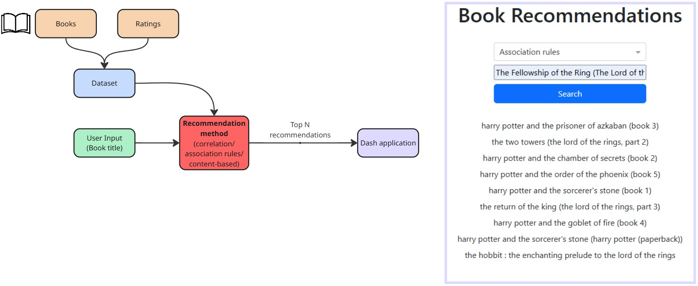

# DataSenticsHW
Martin Takács

## Code Review
File: [*book_rec.py*](book_rec.py)
- DS path and book list (*LoR_list*) should be parametrized
- *error_bad_lines* is deprecated and should be replaced with *on_bad_lines = 'skip'*
- code should not contain unnecessary lines/comments (user ratings)
- check if value is string before trying to lowercase it
    - attribute 'Year of Publication' was lost due to the error
- variable naming: *tolkein_readers* are actually readers of the LOTR 1
- what if the *books_to_compare* was empty?
    - error on drop empty result
- there's no need to do count aggregation on every column, counting users is sufficient
- after the count aggregation, *User ID* attribute no longer stands for the ID, but the count of IDs (naming)
- *dataset_for_corr* might be too wide
- if *LoR_book* is not specified/undefined -> error

## Productionalized Code
File: [*prod_book_rec.py*](src/prod_book_rec.py)
- Constants -> parameters
- For loop -> pandas vectorized opperations
- Cleaner code and lower memory requirements (less attributes in tables) 

To get recommendations issue command:
```
python prod_book_rec.py [OPTIONS]
```
```
Options:
  -r, --ratings_file TEXT       Path to the ratings CSV file.
  -b, --books_file TEXT         Path to the books CSV file.
  -i, --book TEXT               Book title to find recommendations for.
  -m, --method [assoc|corr|cb]  Method for recommendations: "assoc" for
                                association rules or "corr" for correlation-       
                                based.
  -n, --top_n INTEGER           Number of top recommendations to display.
  --help                        Show this message and exit.
```

## Application Design



## Other Recommendation Methods
File: *rec_methods.py*
### Association Rules
Dataset: [*Books.csv*](data/Books.csv), [*BX-Book-Ratings.csv*](data/BX-Book-Ratings.csv)

Association rules are collaborative filtering method. **Lift** is used as a metric to compute recommendations. Lift is a ratio between **confidence** and **support**. The confidence is a conditional probability of one book being reviewed if the other book had been reviewed. The support is only the probability of the book being reviewed.

### Content-Based Recommendations
Dataset: [*goodreads.csv*](data/goodreads.csv)

To compute recommendations, the book title and genres are concatenated and one-hot encoded using *sklearn* library. Then, a cosine similarity is calculated to provide the most similar books to the prompted book.

## Frontend
File: [*app.py*](app.py), [*app_utils.py*](src/app_utils.py)

For a simple user interface a Dash application has been created. The application runs in the web browser. To run the application issue command:
```
python app.py
```
And open the address shown in the terminal.

The application consists of the dropdown menu for the recommendations method selection, text field for the book title and a search button.

Upon pressing the search button, recommendations are displayed as book titles in separate rows. No images have been included.